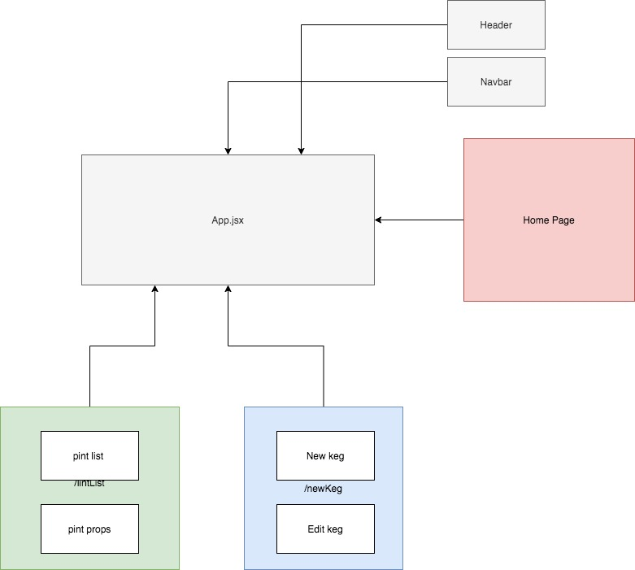

# _Old Time Saloon_

#### _This program allows the user to review a broad selection of beers_

#### By _**Everett Lee-Wuollet**_

## Description

_This is an application for both a customer and employee of a bar. It provides separate views for each, with useful information like price, brand and how many pints are left in the keg. This app currently has two routes, one that will display keg data to user or employee, and the other for creating new Kegs. Their is also a navbar and header, as shown in this diagram._

## Setup/Installation Requirements

* _Access the GitHub repository by copying this (https://github.com/ELee-Wuollet13/React-project-taproom) link into a console command to 'git clone [link]'_
* _navigate into the program and enter the console command 'bash startup.bash' this will automatically run 'npm install and npm run start'. As of submission no other setup is required._
* _In your browser go to 'localhost:3000'_
* _click the Navbar links to access the menus_

## Known Bugs

_As of submission there are no known bugs_

## Support and contact details

_If you have any questions comments or concerns please contact me via Email at everett.leewuollet@gmail.com_

## Technologies Used

_This app was made using React_

### License

*Determine the license under which this application can be used.  See below for more details on licensing.*

Copyright (c) 2016 **_Everett Lee-Wuollet_**
